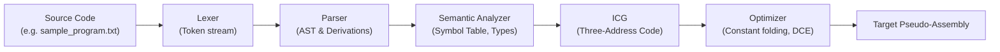
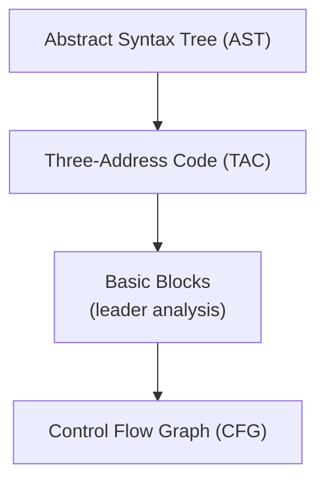

# Python-Compiler-

A compact, educational Mini-Compiler demonstrating the full classical compilation pipeline: lexical analysis, syntax analysis (parsing), semantic analysis (symbol table and type checking), intermediate code generation (three-address code), simple optimizations, and pseudo-assembly output.

Purpose & Motivation
--------------------
This repository was built as a hands-on learning project to explore how high-level source code is progressively transformed into lower-level representations. It helps learners and reviewers see the data structures and algorithms used by compilers: token streams, parse trees/ASTs, symbol tables, control-flow graphs, three-address code, and basic optimization passes. The project is intentionally small and focused so ideas can be experimented with and understood end-to-end.

Core concepts explained
----------------------
- Lexical Analysis (Lexer)
  - Breaks raw source text into tokens (identifiers, literals, operators, keywords, punctuation). The lexer also performs simple error detection for invalid tokens.

- Syntax Analysis (Parser)
  - Consumes token streams and validates program structure against a grammar. The parser builds an Abstract Syntax Tree (AST) and logs derivation steps for didactic purposes. This project includes an LL(1)-style parser with helper routines to build and inspect parsing tables.

- Semantic Analysis & Symbol Table
  - Traverses the AST to enforce language rules: type checking, declaration/usage checks, scope handling and symbol table construction. The symbol table stores type, offset and size information for each declared symbol.

- Intermediate Code Generation (ICG)
  - Translates the validated AST into three-address code (TAC). TAC uses temporaries and labels to make control and data flow explicit. TAC is suitable for analysis and simple optimizations.

- Optimizations & Target Generation
  - Basic optimizations (constant folding, dead code removal in simplified form, local value numbering where feasible) are applied to TAC, and a simple pseudo-assembly is emitted for inspection.
 
Diagrams
--------

Overview of the compilation pipeline:

AST → Intermediate representations and control-flow:

Captions:
- The first diagram shows the sequential phases any input program traverses inside this mini-compiler.
- The second diagram highlights how a hierarchical AST is lowered to linear TAC, then partitioned into basic blocks and connected into a CFG for analysis/optimization.

Why this is useful
-------------------
- Learning: Makes compilation phases tangible and observable with runnable examples.
- Prototyping: A small, modifiable codebase to test new language features, grammars, or optimization ideas.
- Teaching: Useful for compiler courses, labs or demonstrations where instructors want students to trace how specific constructs (loops, conditionals, expressions) are handled.

Quickstart
----------
- Interactive menu:

  python3 main.py

- Non-interactive run of the provided example:

  python3 -c "from main import example_program, analyze_code; analyze_code(example_program())"

- Output files generated by runs:
  - ast_structure.txt — readable tree dump of the AST
  - ll1_table.txt — LL(1) parse table snapshot

Project layout (high level)
---------------------------
- main.py: Interactive menu, examples, and the top-level pipeline runner
- lexer.py: Tokenizer implementation and token definitions
- parser.py: Parser that builds the AST and logs derivations
- ll1_parser.py / first_follow.py: Utilities to construct LL(1) parsing tables
- compiler_core.py: Shared enums, exceptions, and small helpers used across modules
- ir.py / icg.py: Intermediate representations and the ICG that produces TAC and basic CFGs
- optimizer.py: Small optimization passes over TAC
- sample_program.txt, semantic_cases.txt: Example source files and semantic test cases

Design & implementation notes
-----------------------------
- The parser and AST are intentionally simple and tree-like so additional passes (codegen, analyses) can traverse them easily.
- Generated artifacts (AST dumps, LL(1) table) are committed for reviewer convenience; they can be removed from source control and added to .gitignore if preferred.
- Temporary files (compiled .pyc) are excluded from commits in this branch; avoid committing binary caches.

Extending this project
----------------------
- Add language features by:
  1. Extending the lexer token regexes in lexer.py
  2. Updating grammar rules in parser.py (and the LL(1) helpers if you rely on them)
  3. Extending semantic checks in the semantic visitor
  4. Translating new constructs to TAC in icg.py and updating optimizer rules

- Add unit tests by creating small source files in tests/ and asserting outputs for the lexer, parser, semantic checker, and generated TAC.

Troubleshooting & testing
-------------------------
- If running the example raises errors, inspect the printed stack trace. AST and LL(1) table dumps (ast_structure.txt and ll1_table.txt) are helpful to diagnose parsing and grammar issues.
- To regenerate outputs, re-run the example program command above.

Contribution and license
------------------------
Contributions and suggestions are welcome. Open an issue to propose structural changes (for example, separating generated artifacts from source). This repository is intended for educational use and experimentation.

Contact / author
----------------
Author: Sanya Wadhawan
